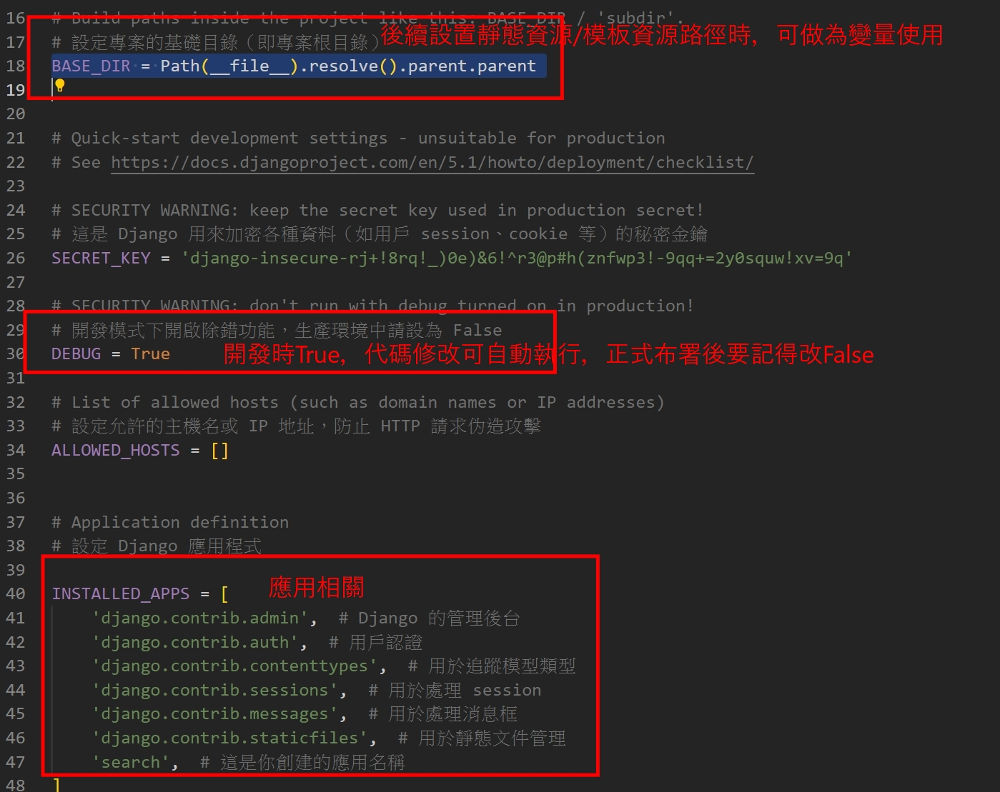
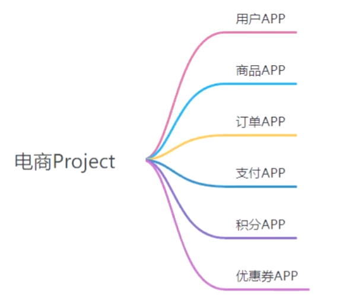
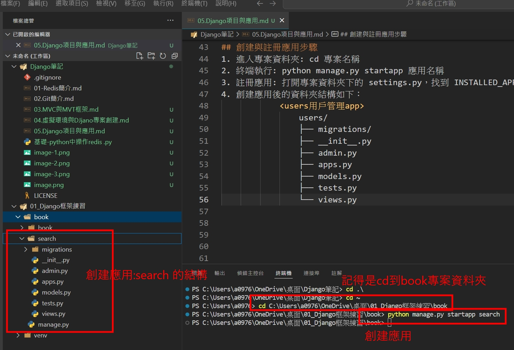
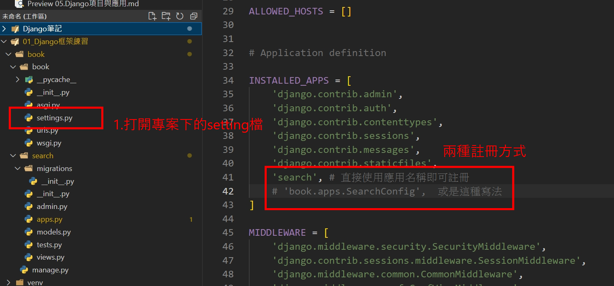

## Django 基礎專案結構
```
    myproject/
    ├── manage.py
    ├── myproject/
    │   ├── __init__.py
    │   ├── asgi.py
    │   ├── settings.py
    │   ├── urls.py
    │   └── wsgi.py
```
## 各檔案與目錄的功用說明： 
1. manage.py: Django 專案的管理工具，用於執行 Django 的各種命令
    - 啟動伺服器：python manage.py runserver
    - 建立資料庫表：python manage.py migrate
    - 建立應用程式：python manage.py startapp <app名稱>
    - 進入 Django Shell：python manage.py shell

2. myproject: (專案名稱資料夾，同名的內部資料夾)
    - Django 專案的核心設定與入口，包含了 Django 專案的主設定檔案。

3. __init__.py: 將這個資料夾標記為 Python 套件，這樣可以作為一個可導入的 Python 模組

4. asgi.py: 支援 Django 的非同步功能

5. settings.py: 專案的主要設定檔案，控制專案的所有配置選項。
    - DATABASES: 資料庫設定。
    - MIDDLEWARE: 中介軟體列表。
    - TEMPLATES: 模板引擎設定。
    - DEBUG: 開發者模式。
    - ALLOWED_HOSTS: 允許的主機名稱。
    


6. urls.py: 用於管理 URL 與對應的視圖函數間的映射關係

7. wsgi.py: Django 專案的 WSGI 伺服器入口，用於部署到伺服器上。


## Django專案與應用的關係

1. 一個專案由多個應用組成，如圖:


## 創建與註冊應用步驟
1. 進入專案資料夾: cd 專案名稱
2. 終端執行: python manage.py startapp 應用名稱
3. 註冊應用: 打開專案資料夾下的 settings.py，找到 INSTALLED_APPS 並將新建的應用名稱加入
4. 創建應用後的資料夾結構如下：
    <users用戶管理app>
```    
    users/
    ├── migrations/
    ├── __init__.py
    ├── admin.py
    ├── apps.py
    ├── models.py
    ├── tests.py
    └── views.py
```
## 練習實例
創建應用:

註冊應用:



