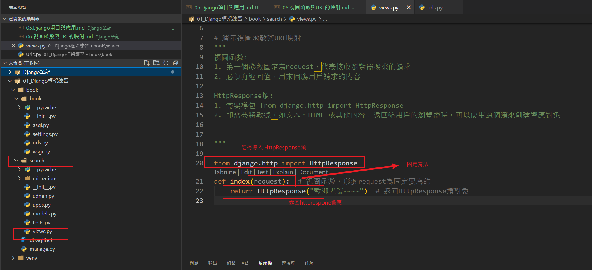
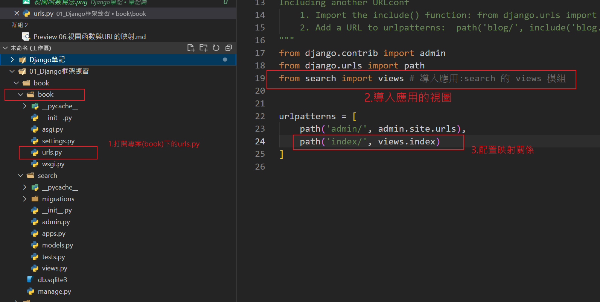
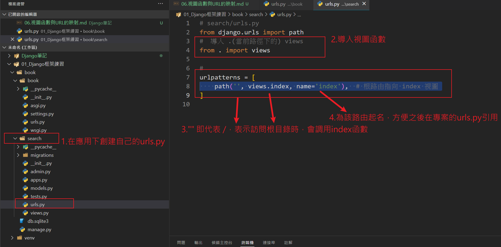
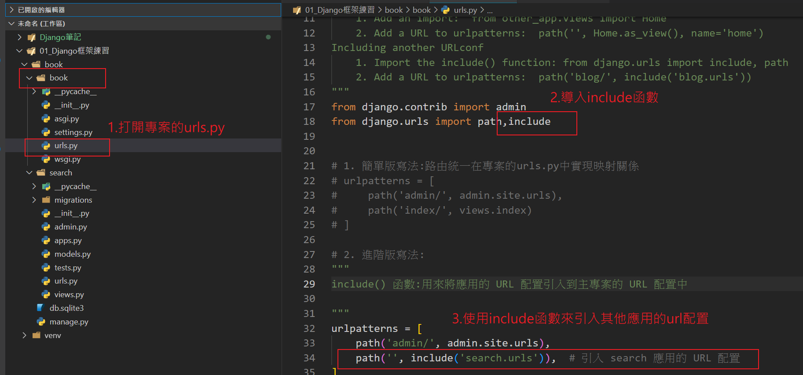

## 視圖函數與URL映射

簡易寫法: 只在專案下的url配置路由，適用於較簡單的網站(應用較少的)

1. 視圖（Views） 定義了如何處理 HTTP 
    - 視圖函數寫在應用下的view.py裡
    
2. URL 映射（URLconf） 負責將 URL 與視圖函數或類別關聯起來。
    - 在專案下的urls.py中的urlpatterns = [] 添加映射
    

進階寫法: 網站較大，需要多個應用時，每個應用程式配置自己的 urls.py

1. 每個應用程式創建自己的 urls.py

2. 在專案的 urls.py 中引用應用程式的路由，搭配include() 函數將每個應用程式的路由引入

##　進階寫法優點：

1. 模組化：每個應用的 URL 配置集中在該應用的 urls.py 中，專案的 urls.py 只需要簡單的引用。
2. 易於維護：每個應用的 URL 配置都能保持獨立，這樣當要修改或擴展某個應用的路由時，不需要去修改其他 應用的路由。
3. 擴展性：若將來新增應用程式，只需要在專案的 urls.py 中添加對應的 include() 設置即可。

