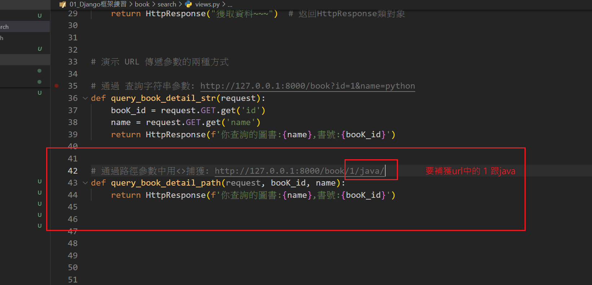
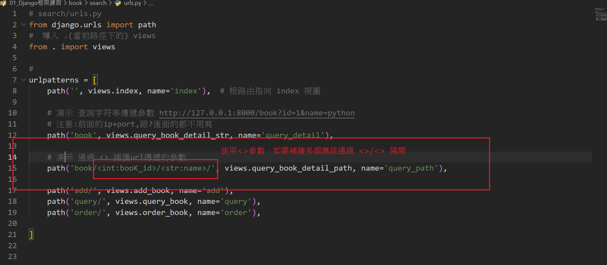
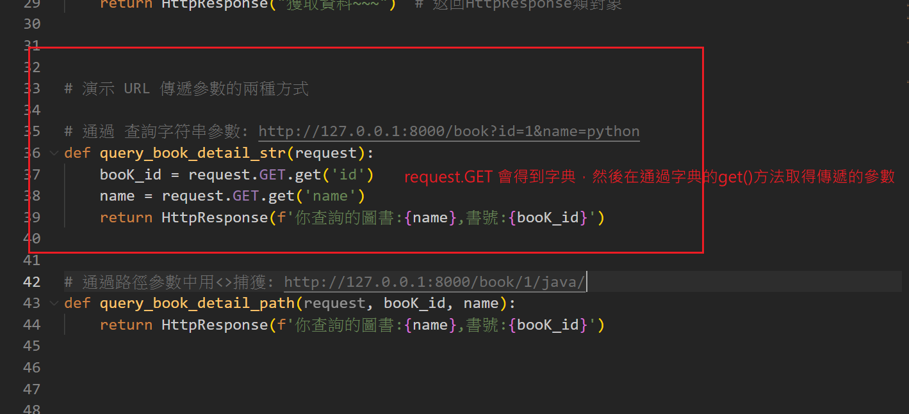
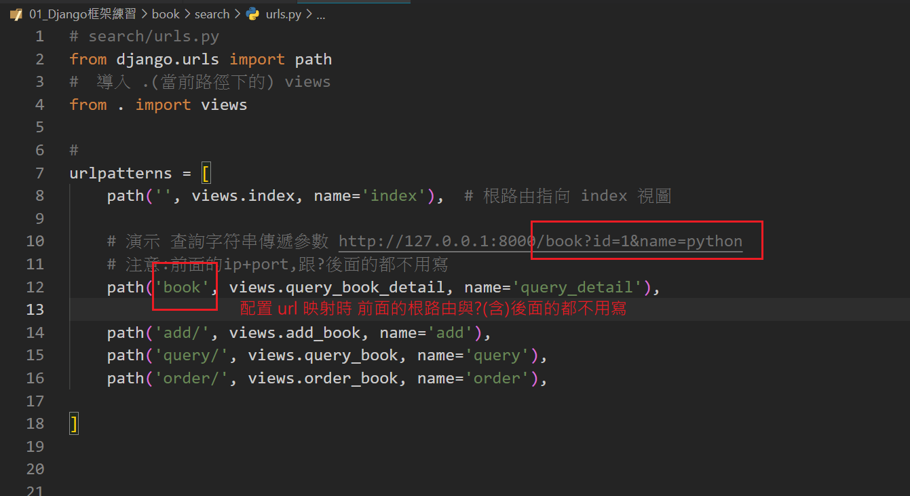

# Django URL 傳遞參數給視圖方式:

# 方式1: 路徑參數
## 語法: path('<參數類型:參數名>/', views.函數名)
- 在path中使用<> 捕獲URL中的參數，並傳遞到視圖函數中。
- converter：用來指定參數的類型（例如 int、str、slug 等）。
- name：參數名稱，在視圖函數中可以使用




### 1. int：捕獲整數型參數
``` python
path('books/<int:id>/', views.book_detail)
```
### 2. str：捕獲任意非空字符串（不包含 /）
``` python
path('authors/<str:name>/', views.author_detail)
```
### 3. slug：捕獲字母、數字、- 和 _，通常用於 URL 中的標識符
``` python
path('posts/<slug:slug>/', views.post_detail)
```
### 4. uuid：捕獲 UUID 類型參數
``` python
path('users/<uuid:uid>/', views.user_detail)
```
### 5. path：捕獲整個 URL 路徑（可包含 /）
``` python
path('files/<path:file_path>/', views.file_detail)
```
### 6. 範例總結:
```python
from django.urls import path
from . import views

urlpatterns = [
    path('books/<int:id>/', views.book_detail, name='book_detail'),
    path('authors/<str:name>/', views.author_detail, name='author_detail'),
    path('posts/<slug:slug>/', views.post_detail, name='post_detail'),
    path('users/<uuid:uid>/', views.user_detail, name='user_detail'),
    path('files/<path:file_path>/', views.file_detail, name='file_detail'),
]
```

# 方式2: 查詢字符串參數 
### 語法: http://example.com/view/?param1=value1&param2=value2
- 將參數作為 URL 的查詢部分傳遞，通常以 ? 開始，並用 & 分隔多個參數。
- param1=value1：第一個參數，名稱為 param1，值為 value1。
- param2=value2：第二個參數，名稱為 param2，值為 value2。

### 示例: 假設有一個 URL http://example.com/search/?query=python&sort=desc
- 在 views.py 中，可通過 request.GET.get() 這樣獲取查詢字符串參數：
- request.GET 會得到類似字典 ex: {'id':3}，故可通過get()方法獲取value
- 記得到urls.py中配置路徑與視圖的映射
``` python
    def search(request):
        query = request.GET.get('query')  # 取得查詢參數 'query'
        sort = request.GET.get('sort')    # 取得查詢參數 'sort'
        return HttpResponse(f'Searching for: {query}, Sort by: {sort}')
```        

   


    