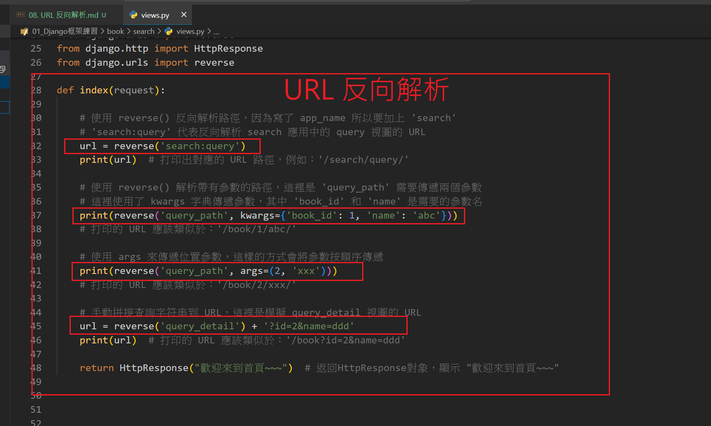

# URL 反向解析
- reverse() 函數是 Django 提供的一個反轉 URL 路徑的工具。它根據 URL 的 name 來生成對應的 
- 使用函數前導包: from django.urls import reverse

## 1. 根據 路由名稱反轉 URL

    urlpatterns = [
        path('home/', views.home, name='home'),     
    ]

    home_url = reverse('home')
    print(home_url)  # 輸出：'/home/'

## 2. 如果 URL 帶有參數

### kwargs 根據命名參數反轉 URL
    urlpatterns = [
        path('article/<int:id>/', views.article, name='article_detail')
    ]

    url = reverse('article_detail', kwargs={'id': 123})

### args 根據位置參數反轉 URL
urlpatterns = [
        path('article/<int:id>/', views.article, name='article_detail')
    ]
url = reverse('article_detail', args(123,))

## 3. 手動拼接查詢字符串 URL

url = reverse('article_detail', kwargs={'id': 123})
query_url = f"{url}?sort=desc&limit=10"
print(query_url)  # 輸出：'/article/123/?sort=desc&limit=10'

## 4. 配置 URL 反轉的命名空間

    app_name = 'app1'

    urlpatterns = [
        path('home/', views.home, name='home'),
        path('article/<int:id>/', views.article, name='article_detail'),
    ]

    url = reverse('app1:article_detail', kwargs={'id': 123})
    print(url)  # 輸出：'/app1/article/123/'

