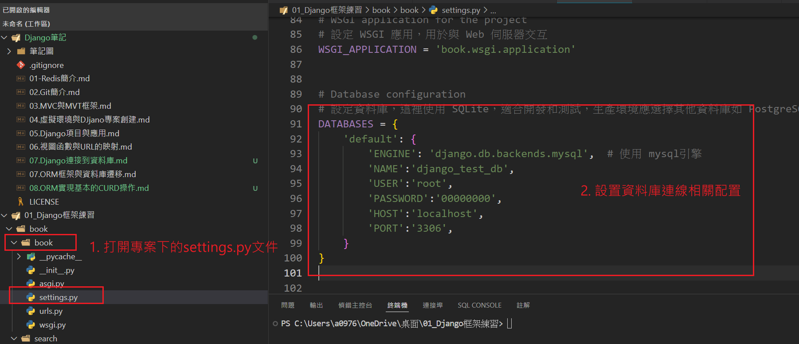

## Django連線到MySql資料庫
1. 安裝 MySQL 驅動程式:pip install mysqlclient(較推薦，也可用PyMySQL)

2. 打開 settings.py 找到 DATABASES 設置(默認為SQLite3)
    
    
        'ENGINE': 'django.db.backends.mysql', # 指定使用 MySQL 數據庫
        'NAME': 'django_test_db',             # 資料庫名稱
        'USER': 'root',                       # MySQL 使用者名稱
        'PASSWORD': 'yourpassword',           # MySQL 密碼
        'HOST': 'localhost',                  # 資料庫伺服器地址 (本地為 localhost)
        'PORT': '3306',                       # MySQL 連接埠 (預設3306)
        

## 常見的資料庫引擎
1. 'django.db.backends.mysql'
2. 'django.db.backends.oracle'
3. 'django.db.backends.postgresql'
4. 'django.db.backends.sqlite3'

