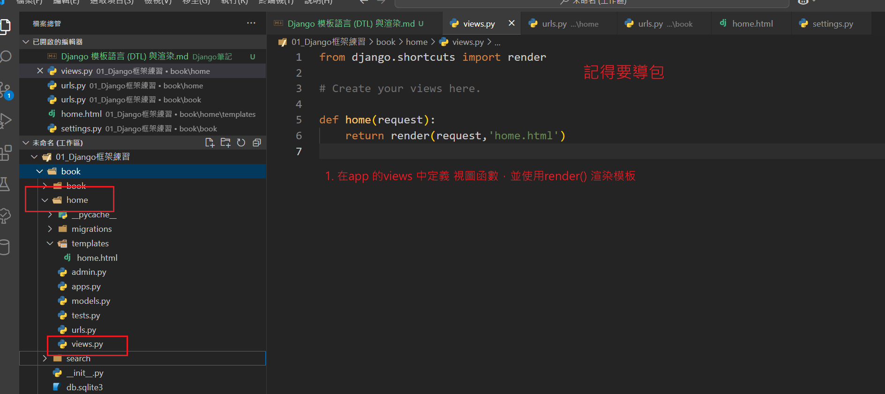
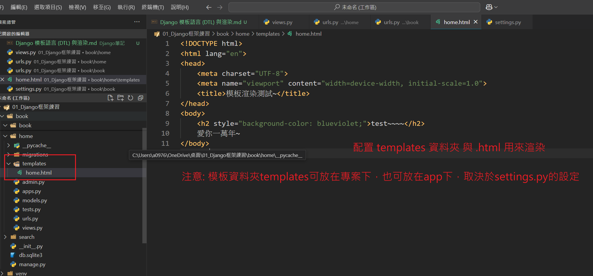
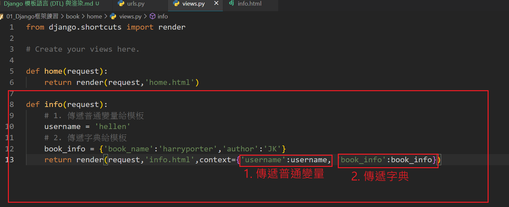
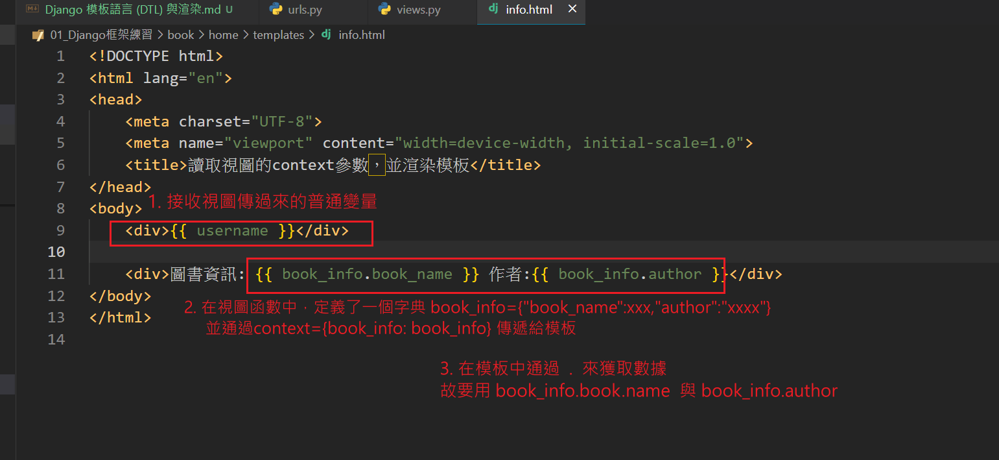
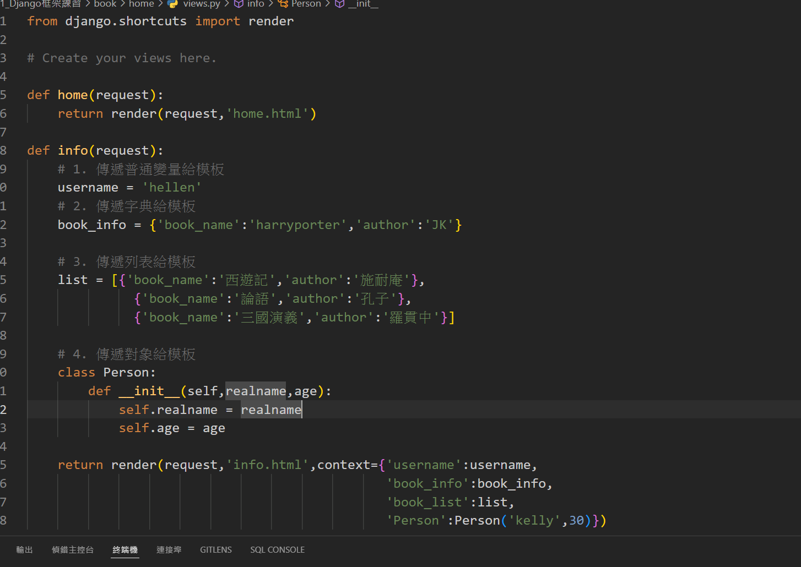
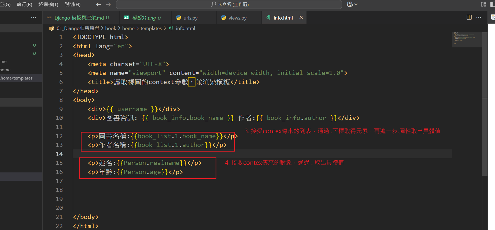

#  渲染模板的概念
- 模板渲染，是將後端數據與模板文件結合，生成用戶最終看到的 HTML 頁面。

# Django Template Language (DTL)
1. Django 框架內建的模板語言，用於在 HTML 中嵌入動態內容。
2. DTL 是一種帶特殊語法的HTML文件，通過簡單的語法結合 Python 數據，實現靈活的頁面渲染。


#　基本渲染模板的方式
1. 使用 render_to_string(): 渲染模板為字符串，在通過httprespone返回出去
    - 要先導入 from django.template.loader import render_to_string

    ``` 
    from django.template.loader import render_to_string
    from django.http import HttpResponse

    def query(request):
        html = render_to_string('book.html')
        return HttpResponse(html)
     ``` 

2. 使用 render(request,'.html') 直接渲染模板並返回HTTP響應
    - 要先導入 from django.shortcuts import render

     ``` 
    def query(request):
        return rander(request,'book.html')
     ``` 
    
    


# 模板查找路徑配置
1. 打開 專案下的 settings.py
2. 找到 TEMPLATES [] 列表如下:

```
    TEMPLATES = [
    {
        'BACKEND': 'django.template.backends.django.DjangoTemplates',  # Django 模板引擎，預設為DTL
        'DIRS': [BASE_DIR/'templates'],  # 模板的目錄路徑，對應專案根目錄下的templates資料夾
        'APP_DIRS': True,  # 使 Django 查找應用中的模板，設定為True就可以讀取到放在app內自己的資料夾
        'OPTIONS': {
            'context_processors': [
                'django.template.context_processors.debug',  # 用於調試顯示
                'django.template.context_processors.request',  # 用於處理請求
                'django.contrib.auth.context_processors.auth',  # 用於用戶認證
                'django.contrib.messages.context_processors.messages',  # 用於消息處理
                ],
            },
        },
    ]
```
    
## 模板變量渲染：
1. 視圖中使用rennder() 時有一個參數: Context，可將數據以字典的形式傳遞給模板。
2. 模板使用 {{ 變量名 }} DTL 語法: 讀取 context 中的變量，可通過 . 來獲取具體值
3. 生成最終的 HTML 頁面：將模板中嵌入的數據渲染到 HTML，返回給用戶端。

    - 傳遞一般變量、字典
    
    
    - 傳遞列表、對象
    
    