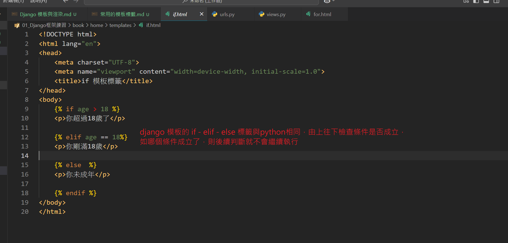
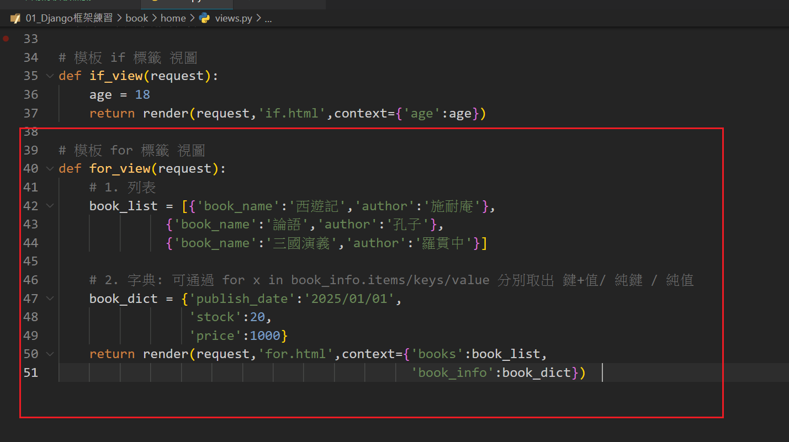
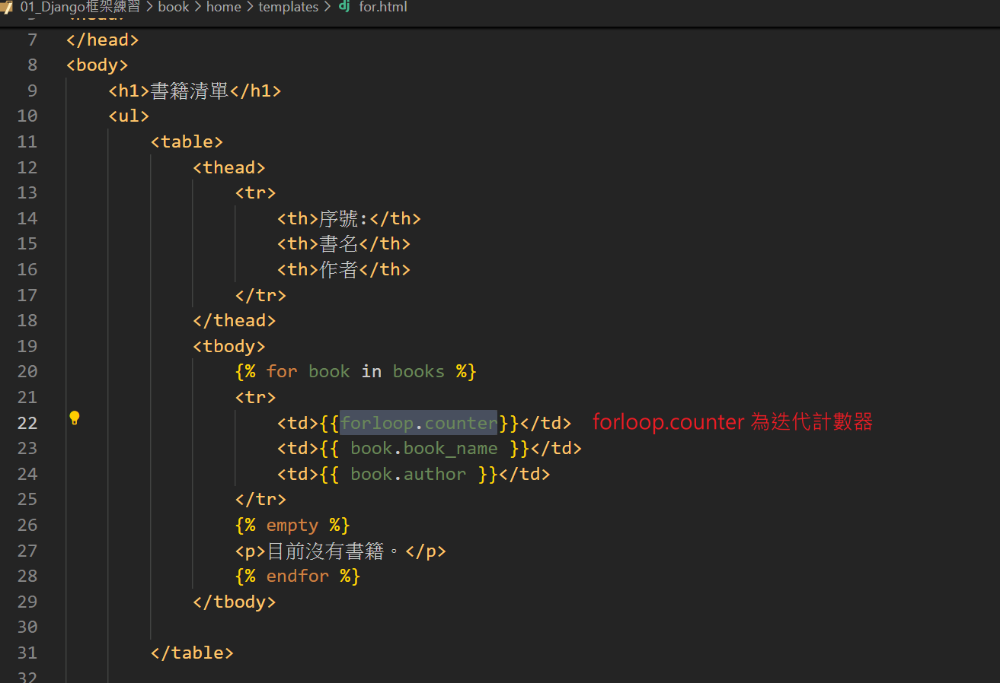
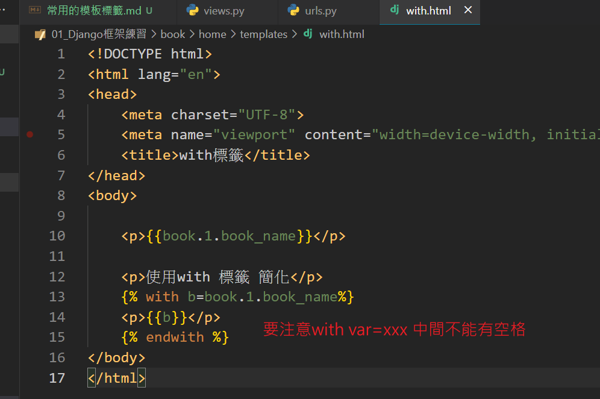
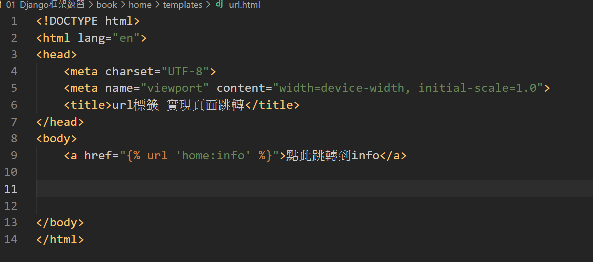

# 常用的模板標籤

## 1. `if` 標籤
用於條件判斷，支持多種邏輯操作。
>、<、>=、<=、==、!=、and、or、not、in、not in、is None、 is not None

**語法：**
```django

    <!-- 當條件成立時執行的內容 -->

    <!-- 當另一條件成立時執行的內容 -->

    <!-- 當所有條件都不成立時執行的內容 -->

```

**範例：**
```django

    <p>歡迎，{{ user.username }}</p>

    <p>請先登入！</p>

```

---

## 2. `for` 標籤
用於遍歷列表或字典，支持變量遍歷。
* 補充: forloop.counter :迴圈中追蹤每次的迭代計數器

**語法：**
```django

    <!-- 針對每個 item 的操作 -->

    <!-- 當列表為空時執行的內容 -->

```

**範例：**
```django
<ul>
    
        <li>{{ book.title }} by {{ book.author }}</li>
    
        <li>沒有找到任何書籍！</li>
    
</ul>
```


---

## 3. `include` 標籤
用於在模板中嵌入其他模板。

**語法：**
```django

```

**範例：**
```django

```

---

## 4. `block` 和 `extends` 標籤
用於模板繼承，讓子模板覆蓋父模板的內容。

**語法：**
父模板：
```django
<!DOCTYPE html>
<html>
<head>
    <title>默認標題</title>
</head>
<body>
    
        <p>默認內容</p>
    
</body>
</html>
```

子模板：
```django


我的頁面標題


    <p>這是覆蓋父模板的內容。</p>

```

---

## 5. `comment` 標籤
用於添加模板中的注釋，注釋內容不會顯示在渲染的 HTML 中。

**語法：**
```django

    這是一段注釋

```

---

## 6. `with` 標籤
用於在模板中創建臨時變量，方便代碼重複使用。
* 注意: var=value 中間都不要有空格
**語法：**
```django

    {{ var }}

```

**範例：**
```django

    <p>{{ full_name }}</p>

```

---

## 7. `static` 標籤
用於加載靜態文件（例如圖片、CSS、JavaScript）。

**語法：**
```django


```

---

## 8. `url` 標籤
用於生成 URL，通常與 `name` 參數一起使用。
基本上與 reverse()相同法

**語法：**
```django
# 一般寫法
<a href="">連結</a>

# 如有指定應用命名空間須加上
<a href="">連結info</a>

# 傳遞參數
<a href="">連結</a>
<a href="">連結</a>
<a href="?page=1">連結</a>

```

**範例：**
```django
<!-- 基本用法 -->
<a href="">回到首頁</a>

<!-- 傳遞位置參數 -->
<a href="">文章詳情</a>

<!-- 傳遞關鍵字參數 -->
<a href="">文章詳情</a>

<!-- 帶命名空間的視圖 -->
<a href="">後台面板</a>

<!-- 拼接查詢字串 -->
<a href="?page=3">更多文章</a>

