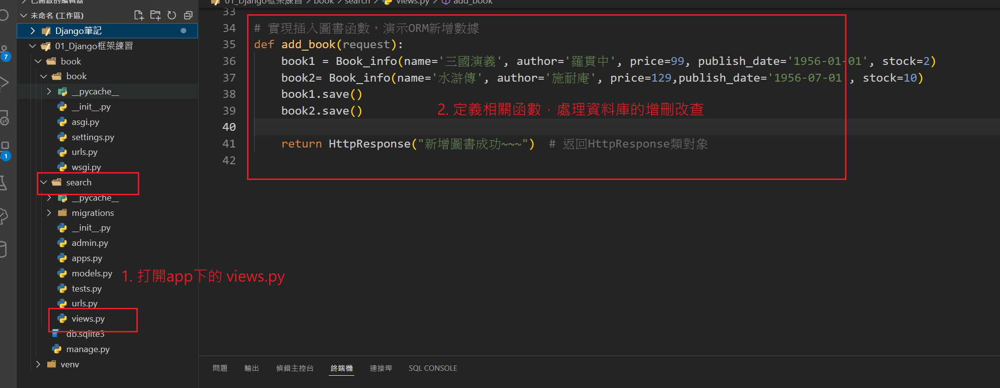
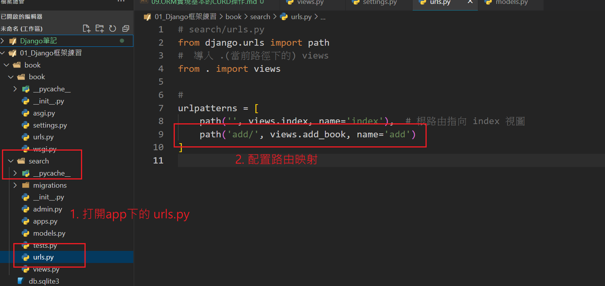

## ORM 操作資料庫步驟
1. 簡單的網站或應用中，可以直接在 app 的 views.py 中定義相關視圖函數實現增刪改查操作。

2. 射配置 `urls.py` 進行路由映射，將 URL 與視圖函數綁定。

# ORM新增數據的方式:

## 1. 使用 create() 直接創建並保存：

    Book_info.objects.create(name="Django 入門", pub_date="2023-10-12", price=299.99)

## 2. 先創建一個模型實例 手動呼叫 save() 儲存： 

    book = Book_info(name="Python 基礎", pub_date="2023-10-10", price=199.99)
    book.save()
## 3. 使用 bulk_create() 批量插入多筆數據：

    books = [
    Book_info(name="數據科學", pub_date="2023-01-01", price=399.99),
    Book_info(name="機器學習", pub_date="2023-02-15", price=499.99),
    ]
    Book_info.objects.bulk_create(books)

# ORM查詢數據的方式:

## 1. 使用 all() 獲取所有記錄

    books = Book_info.objects.all()

## 2. 使用 get() 單個記錄查詢（需確保結果唯一）

    try:
        book = Book_info.objects.get(id=1)
    except Book_info.DoesNotExist:
        print("未找到該記錄")
    except Book_info.MultipleObjectsReturned:
        print("查詢結果不唯一")

## 3. 使用 filter() 根據條件過濾記錄 
    會返回一個QuerySet 對象（類似列表，故可搭配first()或使用索引取出單一對象

    book = Book_info.objects.filter(name='水滸傳').first()
    print(book.name)

    book = Book_info.objects.filter(name='水滸傳')
    print(book[0].name)
    

## 4. 使用order_by()排序查詢
    小到大排序:books_by_price = Book_info.objects.all().order_by('price')
    大到小排序(-):books_by_price = Book_info.objects.all().order_by('-price')

# ORM更新數據的方式:

## 1. 先查詢後通過賦值修改資料，並使用save() 更新記錄
    
    book = Book_info.objects.get(id=1)
    book.price = 299.99
    book.save()

## 2. 使用 update() 批量更新

    Book_info.objects.filter(name="水滸傳").update(price=399.99)

# ORM刪除數據的方式:

## 1. 使用 delete() 刪除單個記錄(先查後刪)

    book = Book_info.objects.get(id=1)
    book.delete()

## 2. 使用 filter() 搭配 delete() 批量刪除

    Book_info.objects.filter(name="水滸傳").delete()