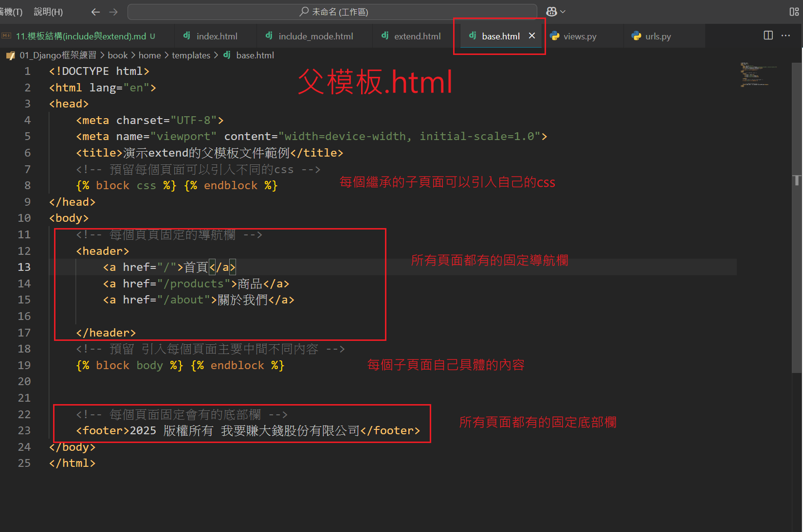
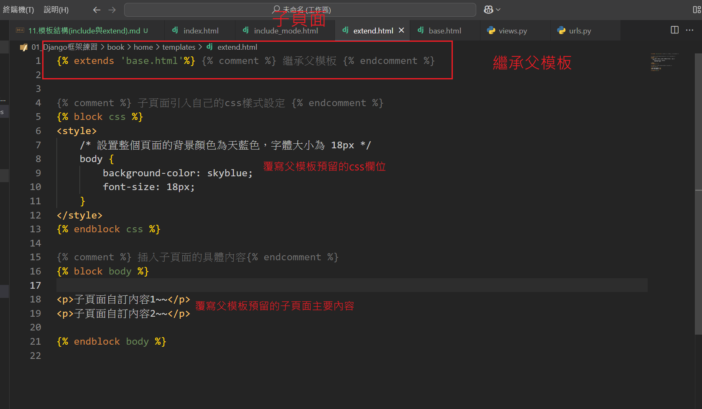
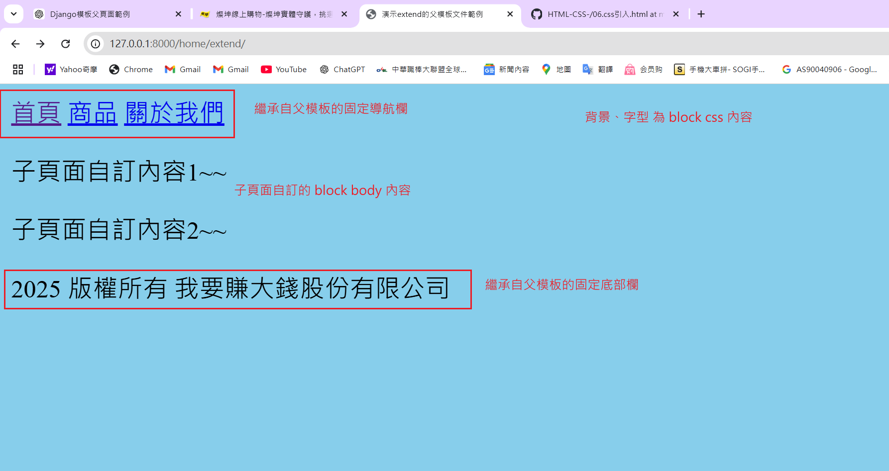
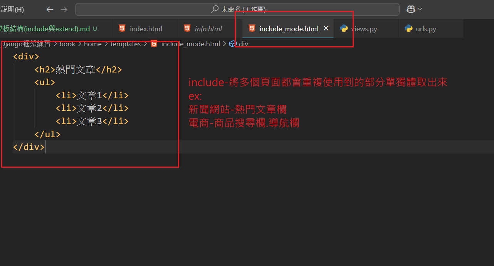
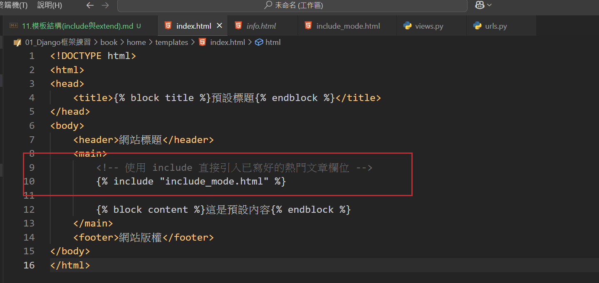
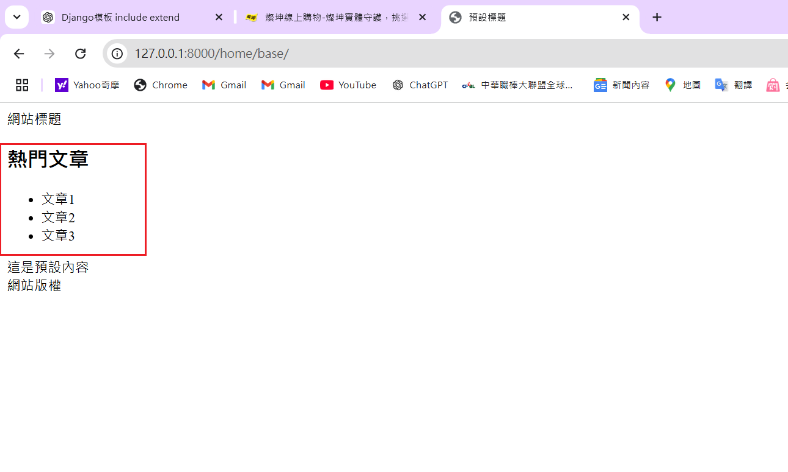
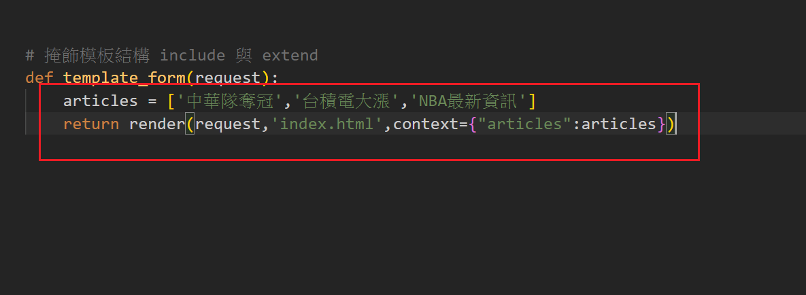
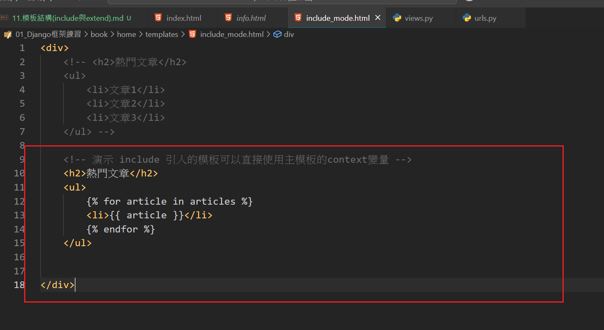
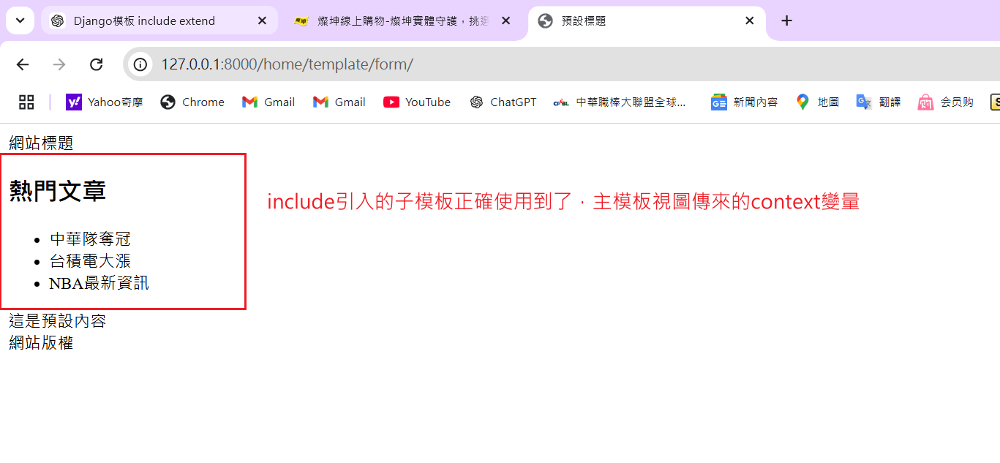

# Django 模板結構中的 `include` 與 `extends`


---

## 1. ``：模板繼承標籤

### 功能
- 用於建立模板繼承結構，讓子模板基於父模板進行擴展。
- 適合用於構建網站的統一佈局，例如頭部、腳部結構相同，但內容部分會因頁面而異。

### 語法
```html

```
- **父模板名稱** 是指基於設置的模板路徑所指定的模板文件。

### 父模板示例
- 父模板通常包含 **block 標籤**，用於定義可在子模板中覆蓋的區域。
- **block 標籤** 後面接的名稱可自訂(ex:title、body、context)
```html
<!DOCTYPE html>
<html>
<head>
    <title>預設標題</title>
</head>
<body>
    <header>網站標題</header>
    <main>
        這是預設內容
    </main>
    <footer>網站版權</footer>
</body>
</html>
```

### 子模板示例
子模板透過覆蓋 `block` 標籤內容來實現自訂。

```html


首頁


    <h1>歡迎來到我們的網站！</h1>
    <p>這是首頁的內容。</p>

```

##　練習實例:




---

## 2. ``：模板引入標籤

### 功能
- 用於引入其他模板文件的內容，類似於代碼片段的復用。
- 適合用於重複的 UI 元件，例如導航欄、側邊欄、或頁腳。

### 語法
```html

```

### 示例
以下是導航欄模板：
```html
<!-- nav.html -->
<nav>
    <ul>
        <li><a href="/">首頁</a></li>
        <li><a href="/about">關於我們</a></li>
        <li><a href="/contact">聯絡我們</a></li>
    </ul>
</nav>
```

在其他模板中使用 `include` 引入該導航欄：
```html
<!DOCTYPE html>
<html>
<head>
    <title>使用 include 的範例</title>
</head>
<body>
    

    <main>
        <h1>這是主要內容區域</h1>
    </main>
</body>
</html>
```

##　練習實例:





### 其他注意事項:
- 被引入的模板可以直接使用主模板的上下文變量





---

## 3. `extend` 與 `include` 的區別
- **用途**：
  - `extend`：繼承模板，用於結構擴展與覆蓋。
  - `include`：引入模板，用於重複內容的插入。
- **適用場景**：
  - `extend`：網站統一佈局。
  - `include`：UI 元件或代碼片段的復用。
- **是否支持 `block`**：
  - `extend`：支援。
  - `include`：不支援。
- **影響範圍**：
  - `extend`：子模板基於父模板進行全局繼承與改變。
  - `include`：僅插入指定模板內容，不改變模板結構。

---

## 4. 注意事項
- `include` 的模板如果需要傳遞變數，可以使用 `with` 語法：
  ```html
  
  ```
- 如果引入的模板不存在且不想引發錯誤，可以使用 `only` 語法：
  ```html
  
  ```

