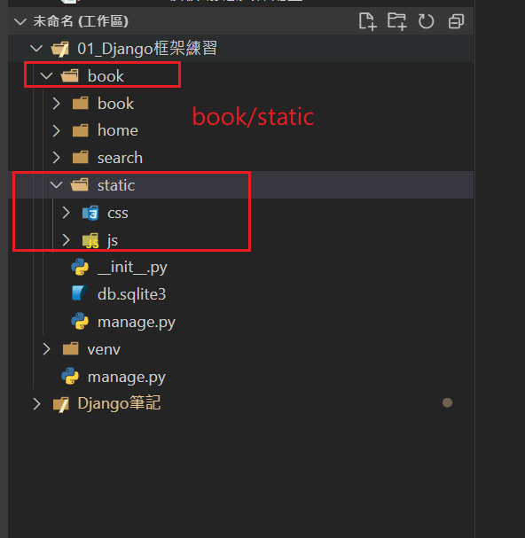
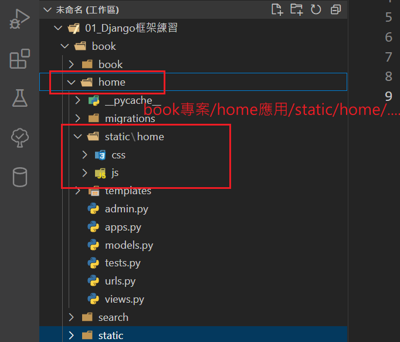
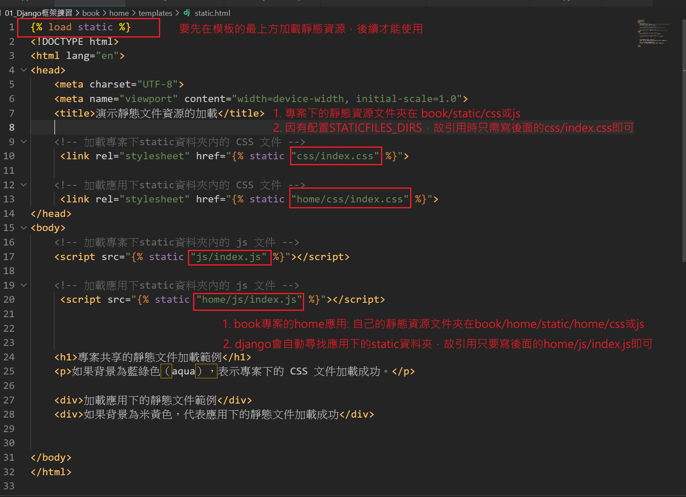

## 靜態文件的位置
在 Django 中，靜態文件（例如圖片、CSS、JavaScript 文件）通常有兩個地方可以存放：

1. 專案根目錄下的靜態資料夾(全專案共享資源)：
ex: book專案的全專案共享靜態資源


2. 每個應用中的靜態資料夾(每個應用自有的資源)：
ex:book專案下，home應用自己的靜態資源



#  配置與使用靜態資源步驟

### 1. 配置 STATIC_URL 和 STATICFILES_DIRS

```
    STATIC_URL = '/static/'  # STATIC_URL 是靜態文件在 URL 中的基本路徑

    STATICFILES_DIRS = [
    BASE_DIR / 'static',  # 這是專案的靜態資料夾,通常在開發模式下，會將靜態文件放在專案的根目錄下
    ]
```

### 2. 配置應用中的靜態文件夾
- Django 會自動查找每個應用中的 static/ 資料夾，故不需要在 STATICFILES_DIRS 中配置這些文件夾。

假設有一個應用 home，並想為它配置專屬的靜態文件夾。可以在 home 應用中創建如下結構：
```
    home/
        static/
            home/
                css/
                    home_styles.css
                js/
                    home_script.js
```

### 3. 在模板中引用靜態文件
- 使用  在模板最上方加載靜態資源文件
- 使用  來引用靜態文件。
- 在settings.py的Templates 中加上 django.template.context_processors.static可以免用

### 範例:
```
      <!-- 加載 static 標籤庫 -->

    <!DOCTYPE html>
    <html lang="en">
    <head>
        <meta charset="UTF-8">
        <meta name="viewport" content="width=device-width, initial-scale=1.0">
        <title>靜態文件示例</title>
        <!-- 使用 static 標籤引用 CSS 文件 -->
        <link rel="stylesheet" href="">
    </head>
    <body>
        <h1>靜態文件測試</h1>
        <!-- 使用 static 標籤引用 JS 文件 -->
        <script src=""></script>
    </body>
    </html>
```
### 練習實例:


### 4. 配置靜態文件收集（collectstatic）

- **目的**：將所有靜態文件（包括應用中的靜態文件）複製到 `STATIC_ROOT` 指定的目錄中，讓 Web 伺服器（如 Nginx 或 Apache）能夠提供靜態文件。
- **使用時機**：當專案準備部署到生產環境時，需要收集所有靜態文件，以便能夠高效地提供靜態資源。

**步驟：**

1. 在 `settings.py` 中配置 `STATIC_ROOT`：

   `STATIC_ROOT = BASE_DIR / 'staticfiles'`  # 收集靜態文件的目錄

2. 在命令行中運行 collectstatic 命令：
    `python manage.py collectstatic`


### 5. 在生產環境中配置靜態文件
- **開發環境與生產環境的差異：**
  - 在 **開發環境** 中，Django 的開發伺服器（runserver）會自動處理靜態文件的提供，不需要額外配置。
  - 在 **生產環境** 中，Django 不會直接處理靜態文件的提供。故通常會配置 Web 伺服器（如 Nginx 或 Apache）來處理靜態文件，以便更高效地提供靜態資源。

- **配置靜態文件的步驟：**

  1. **在 urls.py 中配置 static() 函數：**
     為了讓 Django 在生產環境中也能正確提供靜態文件，需要在 urls.py 中配置靜態路徑。這樣即使在開發模式下，靜態文件也能夠被正確處理。
        ```
        from django.conf import settings
        from django.conf.urls.static import static

        urlpatterns = [
            # 你的其他 URL 路由
        ] + static(settings.STATIC_URL, document_root=settings.STATIC_ROOT)
        
    - ***settings.STATIC_URL***：靜態文件在 URL 中的基本路徑，通常設為 /static/。
    - ***settings.STATIC_ROOT***：靜態文件收集後存放的目錄，通常會透過 collectstatic 命令將靜態文件收集到這個目錄中。


