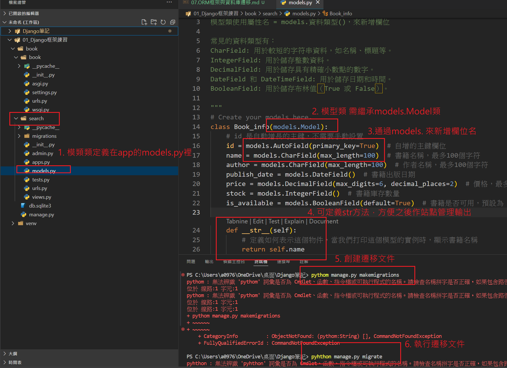

## ORM（Object-Relational Mapping，物件關聯映射）
1. 將對象與關聯式數據庫中的表格建立映射
    - 一張資料表對應一個模型類
    - 每個欄位對應一個類的屬性
    - 每一行數據對應模型類的一個實例

2. 能夠通過操作類的方式來操作數據庫，而無需直接撰寫 SQL 查詢語句。
    
## 資料庫遷移
1. 管理和同步資料庫結構變更的機制。
2. 允許開發過程中不斷更改資料庫結構，並確保這些變更能夠同步到資料庫。
3. 遷移文件可以與代碼一起提交到版本控制系統（如 Git）
4. 支援回退操作

## 定義模型類與資料庫遷移的流程
1. 在應用下的models.py 裡定義模型類:
    - 使用 models 模組來定義資料表欄位
    - 模型類需繼承基類models.Model
    - 定義時避免使用mysql或python的關鍵字

2. 執行命令創建遷移文件: `python manage.py makemigrations`

3. 執行應用遷移文件: `python manage.py migrate`
    - 執行前要確保該app已經註冊到settings.py 的 INSTALLED_APPS 列表中

4. 檢查遷移狀態: python manage.py showmigrations

