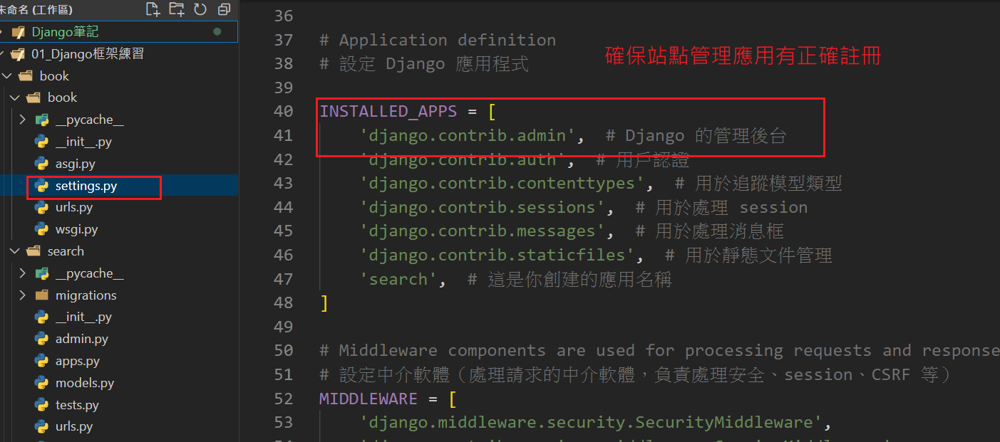
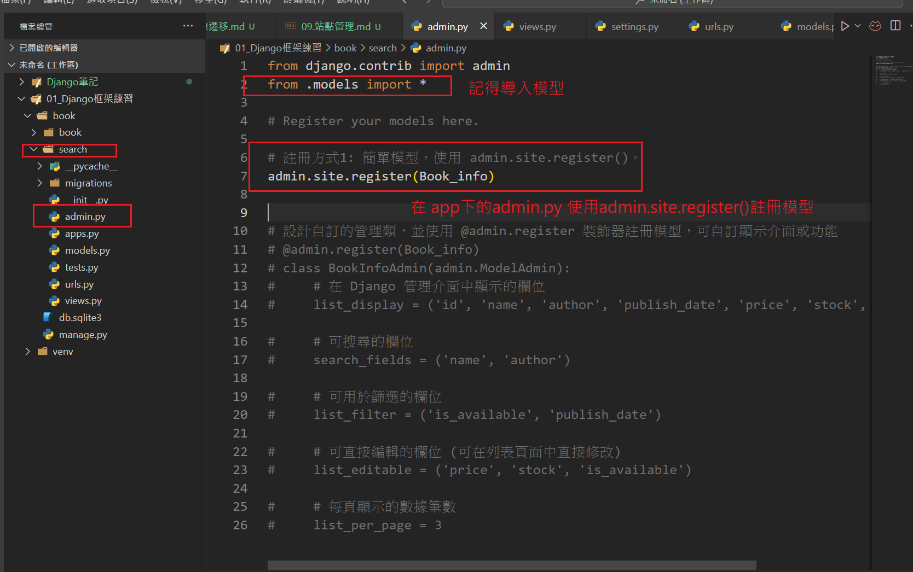
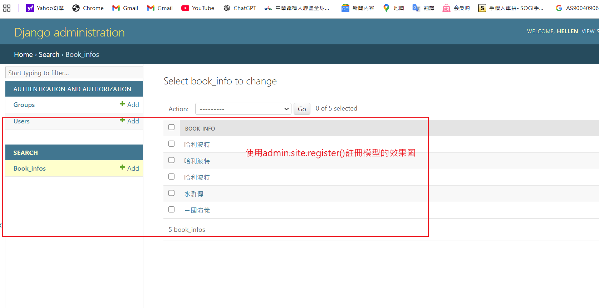
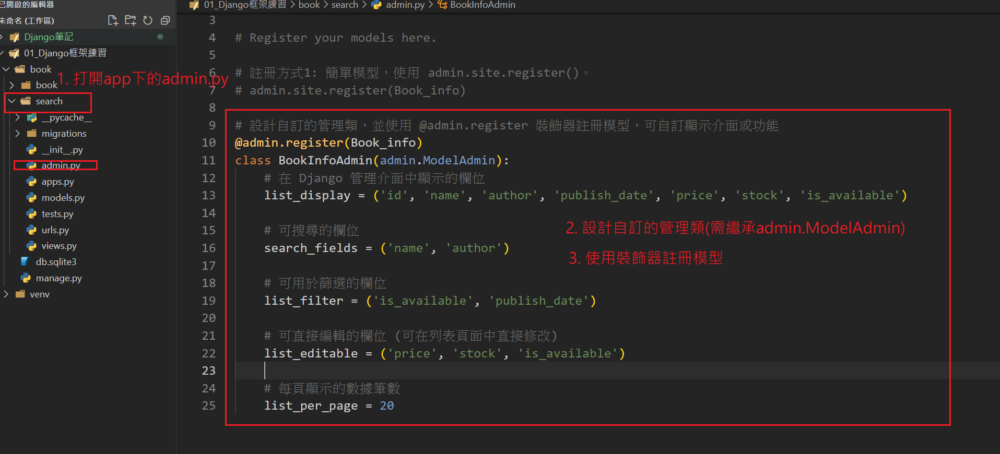
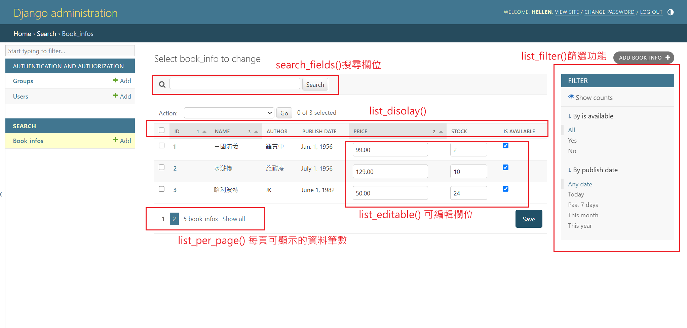

## Django 站點管理
- 為內建管理介面 (Django Admin)。這是一個自動生成的 Web 界面
- 允許管理者對資料庫中的模型進行增刪查改操作，適用於網站後台管理。
- 管理用戶及權限控制

## 使用站點管理系統操作資料庫步驟
1. 確認 django.contrib.admin 在 INSTALLED_APPS 

2. 執行遷移命令
    - `python manage.py makemigrations`
    - `python manage.py migrate`
3. 創建超級用戶
    - `python manage.py createsuperuser`

4. 啟動伺服器並登入 /admin
    - `python manage.py runserver` 
5. 在 app 下的admin.py註冊自訂模型
    - 簡單模型的註冊方式: admin.site.register()
    
    

    - 自訂管理介面註冊方式:
        - 定義介面管理類(需繼承自admin.ModelAdmin)
        - 使用裝飾器註冊模型 @admin.register()
        
        

    
